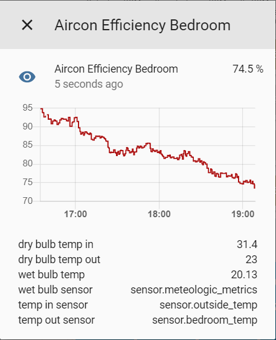

# Introduction
This sensor component calculates the efficiency (%) of your evaporative air conditioning system given sensory inputs such as temperature, humidity and atmospheric pressure.




# Configuration

```
- platform: cooler_efficiency
  name: "Aircon Efficiency Bedroom"
  outdoor_temp: sensor.outside_temp
  indoor_temp: sensor.bedroom_temp
  wet_bulb_temp: sensor.meteorologic_metrics
```

Note that this component requires the wet bulb temperature (WBT, a metric measured by a temperature sensor wrapped in a wet cloth). The purpose of this is to measure the cooling effect of evaporation. Since this is impractical to measure without special equipment, I have created another component called `meterologic_metrics` which calculates the WBT given the temperature, humidity and pressure at your location.

The simplest way to process is to install both components and use one as the input to the other.

[Meterologic Metrics Component on Github](https://github.com/danobot/meteorologic_metrics)


[Buy me a coffee](https://www.gofundme.com/danobot&rcid=r01-155117647299-36f7aa9cb3544199&pc=ot_co_campmgmt_w)


